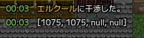
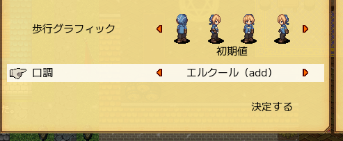
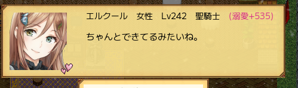
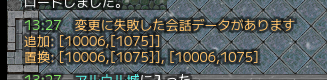

\* Sorry, this document is machine-translated and not post-edited yet

## How to Modify Tones

### Note
Be aware that **all characters using the same tone will be affected**, making it unsuitable for generic tone characters.  
However, it's possible to utilize generic tones selectively depending on the situation, such as adding conversation lines not seen by non-party characters when there's only one slave in the party.

For unique NPCs, the conversation patterns are shared with generic ones, so changes may affect other characters.

- シャルドー
- カーマイン
- ジェイル
- タカオミ
- ナツタメ
- エヅハ
- カエ

There's a possibility that certain lines, like temporary departure lines during events or Ikuriyo's expulsion lines, might not be changed.  
*If there's enough demand, these constraints might be addressed in updates.*

### How to Modify Tones
Modifying tones generally involves synthesizing the content of tone files loaded into the game with the tone of the target NPC.  
Hereafter, the tone file will be referred to as src, and the tone of the target NPC as dst.

Currently, there are two methods of tone synthesis: "Replace" (ReplaceThrough), which removes the originally set tone, and "Merge," which adds without removing the tone. Both modes can be applied to the same character.  
For instance, you might want to replace dialogue when spoken to but add dialogue when interacting with objects like desks.

Additionally, in both modes, empty entries in src won't affect dst.

#### 1. Investigate Pattern ID of dst (Target NPC's Tone)
To perform synthesis, you need to investigate the Pattern ID of dst (internal ID referring to the basic conversation pattern).  
You can do this using Plustalk's investigation feature.

First, open the configuration file `talk-setting.js` inside plustalk's Mod folder (`plustalk` folder).  
You'll find `isCheckTalkMode` initially set to `false`. Change it to `true`.

```js
LOADDATA = {
  isCheckTalkMode: true,
  //...
```

With this setup, when you start the game, you'll see information like this when interacting with NPCs:



The sequence of four numbers represents [Pattern, Talk, SubPattern, OverridePattern] IDs.  
For configuration, you'll use the first Pattern ID.

For example, let's say we're modifying the tone for the Pattern ID `1075` (Hercule) this time.

Once you've finished the investigation, you can safely revert `isCheckTalkMode` back to `false`.

#### 2. Prepare src (Tone File to Be Synthesized) and Load It into the Game as Usual
Create a tone file.

As mentioned earlier, whether replacing or adding, empty entries in src won't affect dst, so only include tone for the necessary parts.  
The `empty.js` file in the distribution folder is a tone file with all fields empty, making it a good starting point for editing.

For example, here's how the tone file content might look like for changing the tone when spoken to in a non-hostile, non-party state (excerpt):

```text
...
#@@#fieldboss#@@#
#@@#babycreate#@@#
#@##message>0>first#@##
#@##message>0>always#@##
こんにちは。
ちゃんとできてるみたいね。
#@##message>0>morning#@##
#@##message>0>afternoon#@##
#@##message>0>night#@##
...
```

Once created, perform the same operation as loading a regular tone file.  
(Place it in `game/mydata/talk` and edit `_LINK.js`)

If it's not loaded into the game, it won't be accessible from the mod.  
It's recommended to give the tone file a clear name like "Hercule (add)" and check if it can be loaded from the tone change screen in the mirror.



Also, remember the ID of the tone file you placed as we'll use it as src in the configuration file later.

#### 3. Configure src to be Applied to dst in the Configuration File
Open `talk-setting.js`.  
(The following is a sample with unnecessary comments removed, indicated by `//`)

```js
LOADDATA = {
  isCheckTalkMode: false,
  replaceThroughSrcAndDsts: [
  ],
  mergeSrcAndDsts: [
  ],
};
```

If you want to replace (remove the original lines), add the ID in the form `[src, [dst]]` to the `replaceThroughSrcAndDsts` list.  
For example, if the Pattern ID of dst this time is `1075` (Hercule), and the tone file created in the previous step is `10007.js`, the configuration would look like this:

```js
LOADDATA = {
  isCheckTalkMode: false,
  replaceThroughSrcAndDsts: [
    [10007, [1075]],
  ],
  mergeSrcAndDsts: [
  ],
};
```

For adding (keeping the original lines), do that to `mergeSrcAndDsts`, not `replaceThroughSrcAndDsts`.

The Mod processes all `[src, [dst]]` in the list, so if you have multiple characters whose tones you want to modify, repeat these steps and list them all.

As mentioned earlier, if you want to replace some lines but add others, you can prepare different tone files for replacement and addition and apply both to the same dst.

#### 4. Confirm Installation Success
Once you've completed the above steps, launch the game.  
If there are no error messages in the log when loading the save and starting the game, the changes have been successfully applied.  
Check if the tone has actually changed based on the tone file you created.



If there are errors in the configuration, error messages like the one below will appear when loading the save.



The error message indicates which setting, either merge or replace, has failed, aiding in troubleshooting.

Checklist if things aren't working:
- Is the installation of maginai completed correctly?
- Are the conditions for adding/replacing the tone confirmed correctly?
- Are the settings written in the correct list for adding/replacing?
- Is the src tone file being loaded?
- Are there any mistakes in the IDs of the src tone file or the dst Pattern ID?

Once configured, tone files will be read every time the game starts, allowing you to change the addition/replacement content by editing the files.

### Additional Notes
Entries starting with `#@@#` in tone files, such as honorifics, can only be changed through the "Replace" process.  
Even if they're written in the tone file being applied through "Merge," they won't have any effect.
